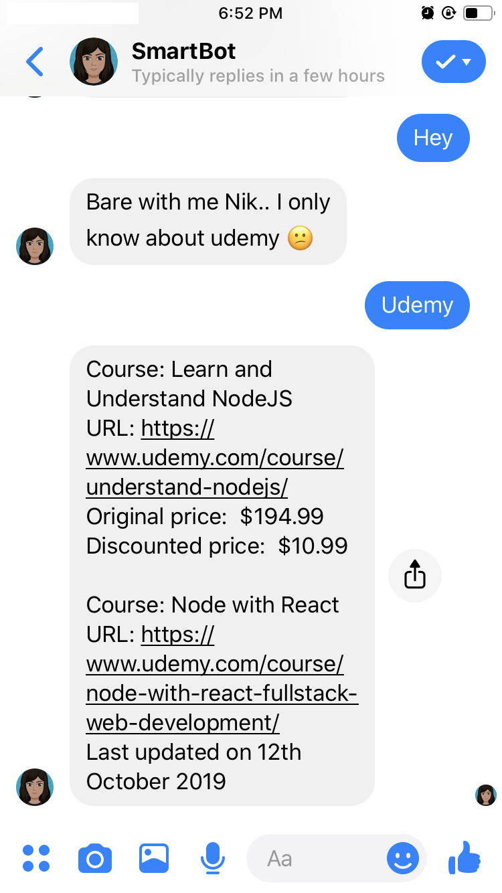

# FB messenger bot with Udemy

Built an FB messenger bot for the purpose of checking for content updates to my Udemy courses. I also want to keep track of when there are discounts for courses I would like to take.

Just a litte side project.. I was bored!

# Tech Stack

- Udemy API
- MongoDB Atlas (used to store courses and keep track of updates from udemy)
- Webhook built with Node/ExpressJS (Hosted on Heroku)

# Wanna deploy with serverless?

serverless invoke local --function udemyCourseTracker

# Improvements

- Enable subscription messaging to allow periodic triggering of webhook
